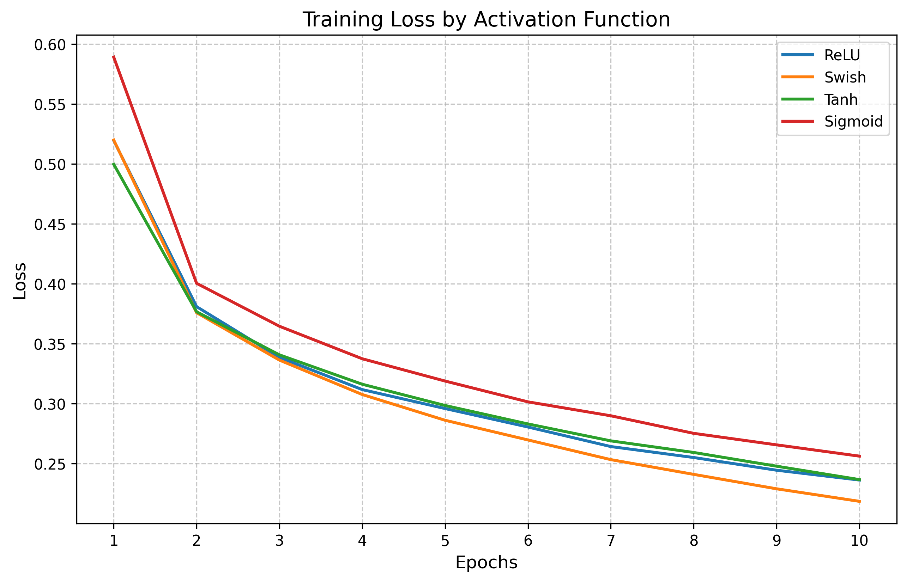

# mlp-activation-analysis_23098873
A comparative study of activation functions (ReLU, Swish, Tanh, Sigmoid) in a 3-layer Multilayer Perceptron (MLP) trained on Fashion-MNIST. Includes PyTorch code, training curves, and reproducibility instructions.

# MLP Activation Function Study  

This repository compares the performance of ReLU, Swish, Tanh, and Sigmoid activation functions in a 3-layer MLP on the Fashion-MNIST dataset.  

## Results  
  

## Setup  
1. Clone the repository:  
   ```bash  
   git clone https://github.com/SAFWANSIDDIQUE-007/mlp-activation-analysis_23098873.git

## Install dependencies
```bash
pip install -r requirements.txt

## Run the Jupyter Notebook
```bash
jupyter notebook activation_study.ipynb  
